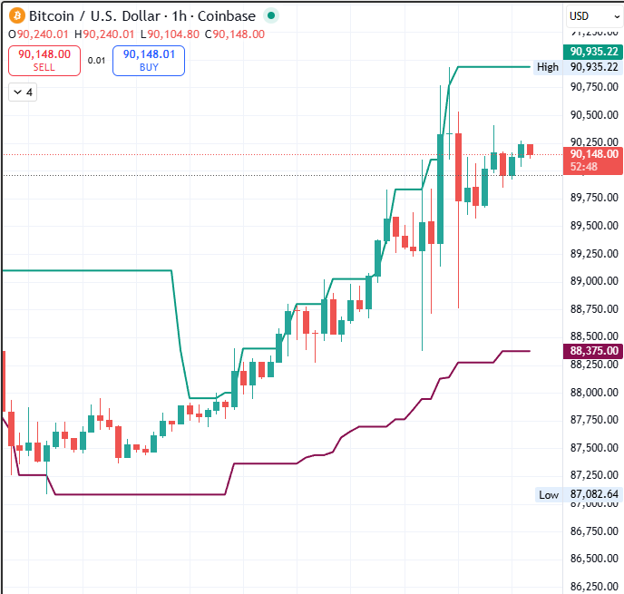

# Pinescript-Library
Collection of of Institutional-grade technical indicators and automated strategy logic developed in pinescript v5

Indicators:
  >HHLL Offset - Used for turtle strategy. Found a problem with tradingview's existing HHLL indicator that it was non-intuitive to create alerts on highs or lows being crossed. By offsetting the indicator to lag 1 minute behind, alerts are now simple and intuitive.

  

  
