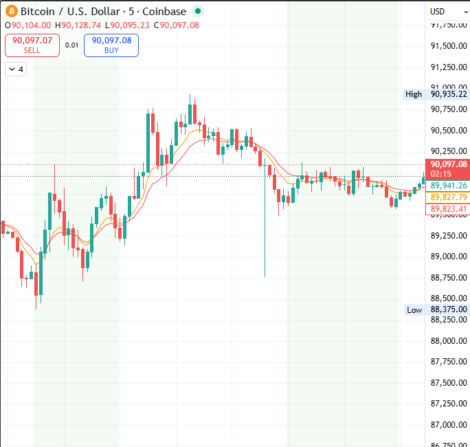
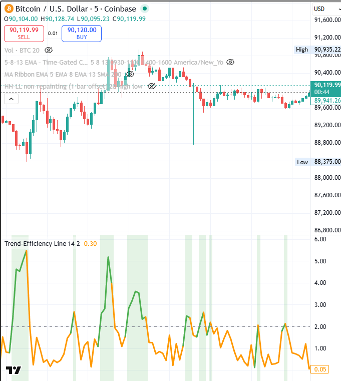

# Pinescript-Library
Collection of of Institutional-grade technical indicators and automated strategy logic developed in pinescript v5

Indicators:
  >HHLL Offset - Used for turtle strategy. Found a problem with tradingview's existing HHLL indicator that it was non-intuitive to create alerts on highs or lows being crossed. By offsetting the indicator to lag 1 minute behind, alerts are now simple and intuitive.

  

  
  >Timegate EMA Cross - Problem: always on alerts fire all day, even outside a traders "trading window". The timegate plots emas and a timewindow that the trader specifies, this stops alerts from firing outside of a specific setup or trade window.

  

  >Trend Efficiency Line - Custom developed taking absolute close values and sma data to create an efficiency threshold. It will not give a signal on its own, but should be used as a supplimental confirmation indicator. Lookback and efficiency number are variable to make it useable across any market and timeframe. 

  

